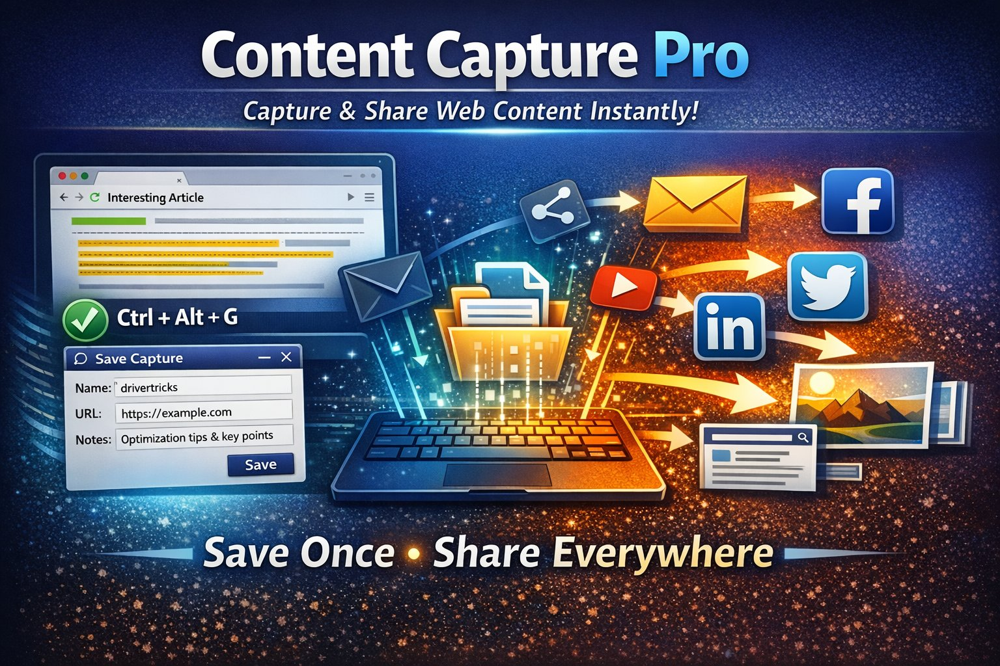

# ContentCapture Pro — Update Notes

## Version 6.5.0

**Date:** February 17, 2026


---

### Overview

Two major features in this release that extend ContentCapture Pro's core mission: capture it once, share it everywhere. Attached images are no longer decorative — they ship with your content to every social platform. And raw video transcripts can now be cleaned and distilled into shareable quotes with a single click.

---

### 🖼️ Feature 1: Social Image Share

**New File:** `SocialImageShare.ahk`

Attached images now travel with your content when you share to any social media platform. When a sharing suffix fires and the record has an attached image, ContentCapture Pro asks if you want to include it. Say Yes and the image goes with your content. Say No and it works exactly like before. Records without images see zero change — no prompts, no interruption.

**Supported Platforms:**

| Platform   | Post Suffix | Comment Suffix | Image Support |
|------------|-------------|----------------|---------------|
| Facebook   | `fb`        | `fbc`          | ✅             |
| Twitter/X  | `x`         | —              | ✅             |
| Bluesky    | `bs`        | —              | ✅             |
| LinkedIn   | `li`        | —              | ✅             |
| Mastodon   | `mt`        | —              | ✅             |

**How It Works — Posts** (`fb`, `x`, `bs`, `li`, `mt`):

- Type your hotstring + suffix (e.g., `;rand50fb`)
- If an image is attached, you are asked to include it
- Platform opens, text goes to clipboard for Ctrl+V
- Ctrl+Shift+V pastes the image
- On-screen tooltip reminds you of the shortcuts
- Press Escape to cancel image paste at any time
- Auto-cleanup after 60 seconds of inactivity

**How It Works — Comments** (`fbc`):

- Click into a comment box
- Type your hotstring + `fbc` (e.g., `;rand50fbc`)
- If an image is attached, you are asked to include it
- Text and image paste fully automatically — no extra steps

**Technical Details:**

- Image-to-clipboard uses PowerShell `System.Windows.Forms.Clipboard.SetImage()`
- All social media compose boxes accept clipboard image paste via Ctrl+V
- Temporary hotkeys (Ctrl+Shift+V, Escape) auto-deactivate after use or timeout
- Character limits enforced per platform (Twitter 280, Bluesky 300, Mastodon 500)
- `IsSet()` fallback checks ensure zero risk of breaking existing behavior
- Platform configuration centralized in `SocialPlatforms` class for easy expansion

---

### 📝 Feature 2: Transcript Format

**New File:** `CC_TranscriptFormat.ahk`

Adds a **📝 Format** button to the Transcript field in the Edit GUI. Raw video and audio transcripts from YouTube, PBS, podcasts, and other sources can now be cleaned up and distilled with one click.

**Three formatting options:**

**🧹 Clean Transcript** — Strips all non-speech content:

- Music cues (♪ ♫ and variations)
- Sound effects and stage directions ((gunfire), (train chugging), (birds chirping))
- Speaker labels (NARRATOR:, EDWARDS:, H.W. BRANDS:)
- Excessive blank lines and orphaned punctuation
- Shows reduction percentage after cleanup

**💬 Key Quotes Only** — Extracts notable interview quotes with speaker attribution:

- Identifies non-narrator speakers and their spoken text
- Formats as "Speaker Name: quote text" in Title Case
- Skips narrator/description passages entirely
- Drops short fragments under 30 characters
- User chooses: replace transcript or copy to clipboard

**🧹 + 💬 Both** — Cleaned transcript on top, key quotes appended at the bottom with a divider. Best of both worlds in one click.

**Example — Before:**

```
♪ ♪ (kids shouting) NARRATOR: A vicious cold snap hit New York
in the first week of February 1897. REBECCA EDWARDS: During the
Gilded Age, Americans feel quite certainly that they are the
vanguard of civilization and progress. ♪ ♪ (train chugging)
```

**Example — After Clean:**

```
A vicious cold snap hit New York in the first week of February
1897. During the Gilded Age, Americans feel quite certainly that
they are the vanguard of civilization and progress.
```

**Example — After Key Quotes:**

```
Rebecca Edwards: During the Gilded Age, Americans feel quite
certainly that they are the vanguard of civilization and progress.
This is an enormous period of opportunity, and possibility, and hope.
```

---

### Installation

**New files (copy to ContentCapture Pro directory):**

- `SocialImageShare.ahk`
- `CC_TranscriptFormat.ahk`

**Add to ContentCapture-Pro.ahk includes:**

```autohotkey
#Include SocialImageShare.ahk
#Include CC_TranscriptFormat.ahk
```

**Edit GUI integration for Transcript Format:**

Add this line where the Transcript field Paste/Clear buttons are created:

```autohotkey
TF_AddToGUI(myGui, transcriptEditCtrl)
```

**DynamicSuffixHandler.ahk — six method updates:**

- `ActionFacebook` → delegates to `SI_SharePost("facebook", ...)`
- `ActionFacebookComment` → delegates to `SI_ShareComment("facebook", ...)`
- `ActionTwitter` → delegates to `SI_SharePost("twitter", ...)`
- `ActionBluesky` → delegates to `SI_SharePost("bluesky", ...)`
- `ActionLinkedIn` → delegates to `SI_SharePost("linkedin", ...)`
- `ActionMastodon` → delegates to `SI_SharePost("mastodon", ...)`

Each method includes a fallback so everything works even if `SocialImageShare.ahk` is not loaded.

See `INTEGRATION_GUIDE.txt` for exact replacement code for each method.

**Delete if present:**

- `FacebookImageShare.ahk` — replaced by `SocialImageShare.ahk`

---

### File Manifest

| File | Status | Purpose |
|------|--------|---------|
| `SocialImageShare.ahk` | **NEW** | Image-aware sharing for all social platforms |
| `CC_TranscriptFormat.ahk` | **NEW** | Transcript cleanup and key quote extraction |
| `DynamicSuffixHandler.ahk` | **UPDATED** | Six Action methods updated for image delegation |
| `ContentCapture-Pro.ahk` | **UPDATED** | Two new #Include lines, GUI integration call |
| `FacebookImageShare.ahk` | **DELETE** | Replaced by SocialImageShare.ahk |
| `INTEGRATION_GUIDE.txt` | **Reference** | Exact code for DynamicSuffixHandler updates |
| `TRANSCRIPT_FORMAT_GUIDE.txt` | **Reference** | Transcript Format integration details |

---

*ContentCapture Pro v6.5.0 — Capture it once. Share it everywhere.*
